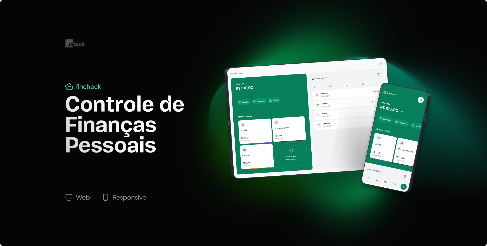

# Fincheck

Fincheck is a personal finance management application designed to centralize your bank account balances, manage income and expenses, and intuitively filter transactions by categories and dates.



## Table of Contents

- [Features](#features)
- [Technologies](#technologies)
- [Installation and Setup](#installation-and-setup)
  - [Backend](#backend)
  - [Frontend](#frontend)
- [Environment Variables](#environment-variables)

## Features

- **Bank Account Management:** Add and centrally manage your bank account balances.
- **Transaction Recording:** Record incomes and expenses with specific categories and dates.
- **Transaction Filtering:** Easily filter transactions by income or expense and by date.

## Technologies

### Frontend

- **Language:** TypeScript
- **Framework:** React
- **Tools and Libraries:**
  - Vite
  - Tailwind CSS
  - React Router
  - Tanstack Query
  - Radix UI
  - React Hook Form
  - Zod

### Backend

- **Framework:** Nest.js
- **ORM:** Prisma
- **Database:** PostgreSQL

## Installation and Setup

### Prerequisites

- Node.js
- Docker

### Backend

1. Install dependencies:
   ```bash
   pnpm install
   ```
2. Start the required containers:
   ```bash
   docker compose up -d
   ```
3. Run Prisma migrations:
   ```bash
   pnpm prisma migrate dev
   ```
4. Start the development server:
   ```bash
   pnpm start:dev
   ```

### Frontend

1. Install dependencies:
   ```bash
   pnpm install
   ```
2. Start the development server:
   ```bash
   pnpm dev
   ```

## Environment Variables

Make sure to set your environment variables according to the examples provided in the `.env.example` files for both backend and frontend. These variables are crucial for database connection configurations, API keys, and other specific environment settings.
